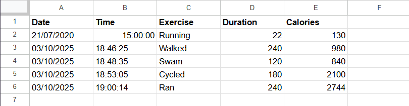

# 🏋️ Workout Tracker

A Python script that logs workout details to Google Sheets by combining natural language exercise input with calorie data from an external API.

## ✨ Technologies

- `Python`
- `Requests`
- `API`
- `HTTP`
- `Datetime`
- `Environment Variables`

## 🚀 Features

- Accepts natural language exercise input
- Calculates calories burned using Nutritionix API
- Logs workout data to Google Sheets via Sheety
- Uses authorization headers for secure requests
- Stores sensitive credentials using environment variables

## 📍 The Process

This project was built as **Day 38 of the 100 Days of Python Code** course and applies multiple concepts learned across previous days.

The user provides a natural language description of their workout. This input is sent to the Nutritionix API, which interprets the exercise, calculates duration and calories burned, and returns structured data.

The processed workout data is then formatted with the current date and time using the `datetime` module and sent to a Google Sheet using the Sheety API. Authorization headers are used to securely write data to the spreadsheet.

This project reinforced working with POST requests, API authentication, environment variables, and combining multiple external services into a single workflow. The script can be further customized by including user details such as age, gender, or weight for more accurate calorie calculations.

## 🚦 Running the Project

1. Clone the repository  
2. Set required environment variables:
   - `NIX_APP_ID`
   - `NIX_API_KEY`
   - `SHEETY_ENDPOINT`
   - `AUTHORIZATION`
3. Install dependencies: `pip install requests python-dotenv`
4. Run the script: `python main.py`
5. Enter your workout description when prompted
6. View the logged data in your Google Sheet

## 🎞️ Preview

